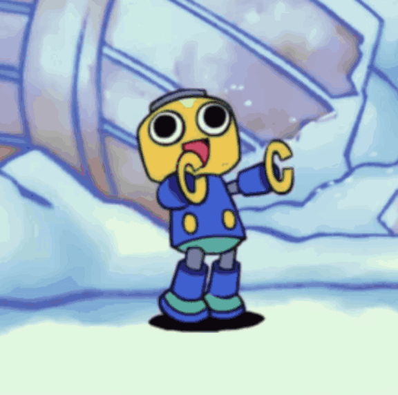
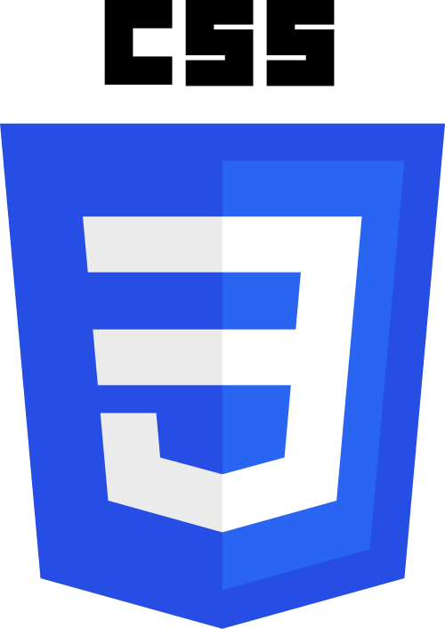
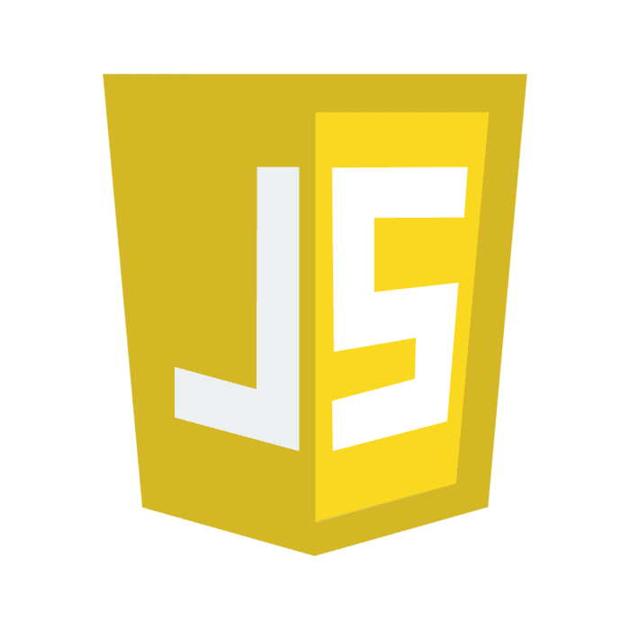

<div align="center">


# hey, i'm boredflush

### 🎓 student • 💻 beginner developer • 🐧 linux enthusiast

*"learning one bug at a time."*

</div>

---

## 💙 about me



- 🎓 Systems Analysis and Development student
- 💻 Beginner developer
- 🐧 Linux enthusiast
- 🎮 Gamer
- 🎵 Music fan
- 🇧🇷 From Brazil
- 🚀 Always learning new things

<br><br><br>

---

## 🔵 currently learning

<div align="center">






</div>

```text
▰ C
▰ SQL
▰ HTML
▰ CSS
▰ JavaScript
▰ Git & GitHub
▰ Linux
```

---

## ⚡ goals


- Build useful projects
- Improve my coding skills
- Learn more about open source
- Create games and applications
- Become a better developer every day

<br><br>

---

## 🎮 things i enjoy


- Retro games
- Minecraft
- Pokémon
- Linux customization
- Music
- Technology
- Open-source software

<br><br>

---

## 📊 github stats

<div align="center">


</div>

---

## 🌐 find me around the web

<div align="center">

<a href="https://github.com/boredflush">

</a>

<a href="https://open.spotify.com/user/BoredF.exe">

</a>

<a href="https://steamcommunity.com/id/BoredFlush">

</a>

<a href="https://linkedin.com/in/_bored_flush">

</a>

</div>

---

## 🧩 current status

```text
Coding..... ████████░░ 80%
Learning... █████████░ 90%
Sleep...... ██░░░░░░░░ 20%
```

---

<div align="center">


```c
while (alive) {
    learn();
    code();
    repeat();
}
```

⭐ Thanks for visiting my profile!

</div>
