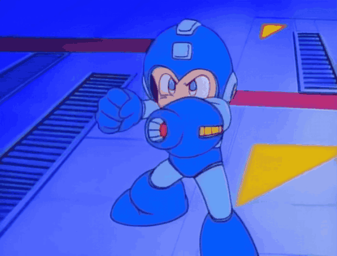

# 🌐 hey, i'm boredflush

  

  

  

  

<i>"Running through the Cyber world"</i>

  
  

---
## 🔗 connect with me

  
  
  
  

---

## 💙 about me

-  Systems Analysis and Development student
-  Beginner developer
-  Linux enthusiast
- Gamer (Pokémon, Megaman, Valorant)
- Music fan (City Pop, Jazz fusion, 80s/90/00s)
- 🇧🇷/ From Brazil
-  Always learning new things

---

## 🔵 currently learning

  
  
  
  
  
  
  

---

## 📘 github stats

<table align="center"><tr>
  <td>
    
  </td>
  <td>
    
  </td>
</tr></table>

  

